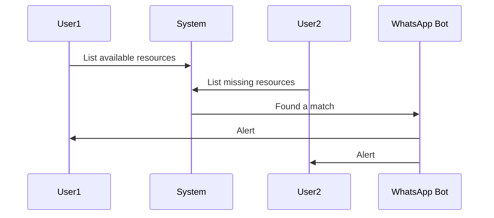
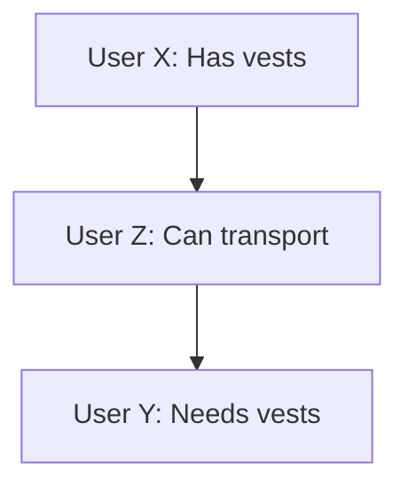

# Resource-Sharing Platform

## Table of Contents

- [Overview](#overview)
- [Personas](#personas)
- [Features](#features)
  - [Joining the System](#joining-the-system)
  - [Resource Management](#resource-management)
  - [Matching and Notifications](#matching-and-notifications)
  - [Transactions](#transactions)
- [Development](#Development)
    - [Structure](#structure)
---

## Overview

This platform aims to facilitate the sharing of resources between different entities, such as organizations and individuals. It matches available resources with those in need and notifies both parties for further action.


---

## Personas

### Organizations

Entities like hospitals, volunteer centers, and military bases that have resources to offer or are in need of specific resources.


```json
{
  "id": "123",
  "name": "hospital",
  "desc": "a good place to volunteer"
}
```

### Individuals

People who either want to donate resources or are seeking specific resources for themselves.

```json
{
  "id": "789",
  "name": "baryo",
  "available": {
    "food box": [
      {
        "quantity": 3,
        "location": "TLV"
      }
    ]
  }

}
```

---

## Features

### Joining the System

- Users can either register manually or be dynamically created based on data from forums, WhatsApp groups, etc.

### Resource Management

- Each persona (organization or individual) can list resources they have available or are missing.
- Resources can have additional details such as quantity, location, time, and category.
- Examples: 
    - 3 combat-vests available in TLV
    - Need 20 volunteers in Beer Sheva tomorrow

```json
{
  "available": {
    "food box": [
      {
        "quantity": 3,
        "location": "TLV"
      }
    ]
  }
}
```

### Matching and Notifications

- The system automatically matches available resources with missing resources.
- When a match is found, both parties are alerted via selected channel.



### Transactions

- Parties can communicate directly to finalize the transaction.
- Both parties can confirm the transaction, updating the quantity of resources available or missing.
- The system supports multi-resource transactions.



---
## Development

### Structure
<!-- add project structure-->
```yaml
packages:
    ts: # pure TS functunality
     lib:
       ts.ts # types 
       
     
```

### Install
Run "yarn"

### Building

Run `nx build` to build all workspace.

Run `nx build ts` to build the specific package.

## Generate new package

Run `name=my_lib yarn genwts` to generate ts lib

Run any [nx generate](https://nx.dev/nx-api/nx/documents/generate) 

### Lib
```
nx generate @nx/<any> \
--preset=ts --directory=/packages/$name \
--publishable \
--importPath=@gvil/$name \
--tags=scope:gvil,type:lib
```
### App
```
nx generate @nx/<any> \
--preset=ts --directory=/packages/$name \
--publishable \
--importPath=@gvil/$name \
--tags=scope:gvil,type:app
```

### Publish

Run "nx publish" to build all workspace
Run `nx publish ts` to build the specific package.


